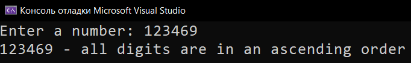
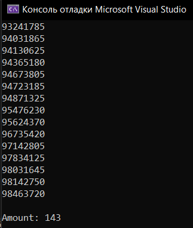
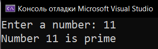
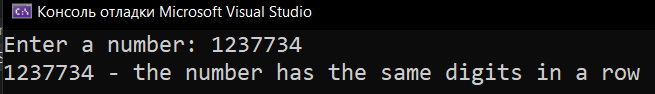
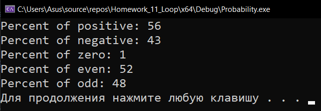

# Homework_11_Loop
Д/з: Loop

<a href="https://gist.github.com/SlavikArt/e24e8ebcae4ddd8acbf5a13dbae5a840">Gist - страница со всеми кодами проектов</a>

* [In_Ascending_Order](In_Ascending_Order)
* [Octal_Numbers](Octal_Numbers)
* [Prime_Number](Prime_Number)
* [Same_Digits_In_A_Row](Same_Digits_In_A_Row)
* [Probability](Probability)

    <h2>In ascending order</h2>
    
Is all digits in ascending order.

    
    <h2>Octal numbers</h2>
    
All octal numbers that modulo divide by 12345.

    
    <h2>Prime number</h2>
    
Is number a prime number.

    
    <h2>Same digits in a row</h2>
    
Is number has same digits in a row.

    
    <h2>Probability</h2>
    
Probability of positive, negative, zero, even, odd numbers from -100 to 100 range.

    

